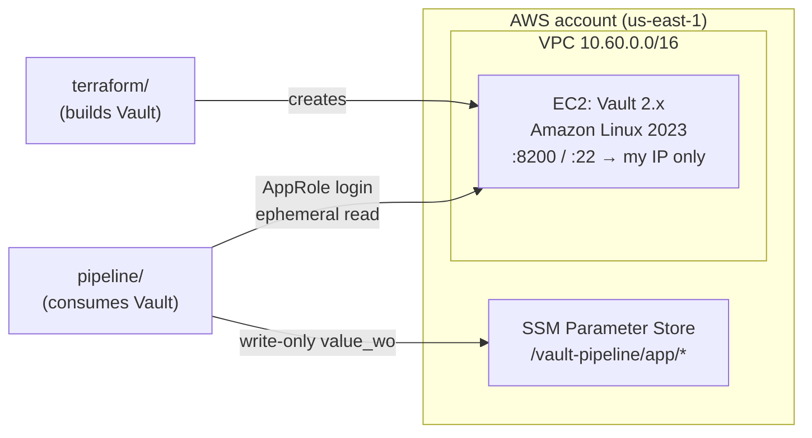

# aws-vault-terraform-pipeline

A self-hosted HashiCorp Vault server on AWS, built with Terraform, and a second
Terraform pipeline that logs in to Vault with a narrowly scoped AppRole, reads a
secret, and delivers it to AWS SSM Parameter Store. The secret value is never
written to Terraform state, plan files, or the repo.



## Layout

```
terraform/   Root 1: VPC, subnet, security group, EC2 instance, Vault install script
pipeline/    Root 2: AppRole login to Vault, ephemeral secret read, write-only delivery to SSM
```

## Design decisions

### 1. Two separate Terraform roots

`terraform/` builds the Vault server. `pipeline/` uses it. They have separate
state files and are applied separately.

They have to be separate because of the order things happen in. The Vault
provider logs in as soon as Terraform configures it, which is at the start of
a plan. If it lived in the same root as the EC2 instance, then on a fresh build
(or after a rebuild) it would try to log in to a Vault server that doesn't
exist yet, or exists but hasn't been initialized and unsealed. Unsealing is a
deliberately manual step (see below), so no single `terraform apply` can go from
nothing to reading secrets.

Splitting the roots also splits the access needed to run each one:

| Root | Talks to | Needs |
|---|---|---|
| `terraform/` | AWS EC2/VPC | AWS credentials that can create infrastructure |
| `pipeline/` | Vault, AWS SSM | An AppRole secret_id and AWS credentials for two SSM parameters |

The pipeline never needs permission to touch the Vault server's infrastructure,
and rebuilding the infrastructure never needs a Vault credential.

### 2. A narrow AppRole for the pipeline

The pipeline logs in as a machine identity (AppRole), not as a person and never
as root. The role is limited as tightly as it can be while still doing its job:

```hcl
# policy: terraform-pipeline
path "secret/data/pipeline/*" {
  capabilities = ["read"]
}
```

```bash
vault write auth/approle/role/terraform-pipeline \
  token_policies=terraform-pipeline \
  token_ttl=10m token_max_ttl=30m \
  secret_id_ttl=1h \
  secret_id_bound_cidrs=<operator-ip>/32
```

| Setting | What it limits |
|---|---|
| `read` on `secret/data/pipeline/*` | Can't write, list, or delete, and can't see any secret outside `pipeline/` |
| `token_ttl=10m`, `token_max_ttl=30m` | A stolen login token is useless within minutes |
| `secret_id_ttl=1h` | Each secret_id is good for one working session; a fresh one is generated per run |
| `secret_id_bound_cidrs` | A leaked secret_id only works from the operator's IP |

If the pipeline's credentials leak, the worst case is that someone on the
operator's network can read the `pipeline/` secrets for an hour.

Credentials reach Terraform only through environment variables
(`TF_VAR_approle_role_id`, `TF_VAR_approle_secret_id`), with the secret_id
entered through `Read-Host -MaskInput` so it isn't shown on screen or saved in
shell history. Nothing in the repo grants access to Vault.

The provider is set to `skip_child_token = true`. By default the Vault provider
creates a child token from the one it logs in with, which needs
`auth/token/create`. That permission isn't in the policy, and it doesn't need
to be.

Human access works the same way. Day-to-day admin work uses a `userpass` login
with an `admin` policy. The initial root token was revoked after that login was
tested. A new root token can be generated from the unseal keys
(`vault operator generate-root`) if it's ever needed.

### 3. Ephemeral reads, write-only delivery

This is the part that keeps the secret out of Terraform's files.

**The problem with data sources.** The usual way to read from Vault is
`data "vault_kv_secret_v2"`. Terraform stores everything a data source returns
in `terraform.tfstate`, in plain text. Marking it `sensitive` only hides it from
the console. Anyone who can read the state file (a backup, a synced folder, an
S3 bucket for remote state, a teammate) gets the secret without ever logging in
to Vault, and Vault's access controls, TTLs, and audit trail don't apply to that
copy.

**The fix has two parts.**

```hcl
# 1. Ephemeral read: fetched during the run and never persisted.
ephemeral "vault_kv_secret_v2" "app" {
  mount = "secret"
  name  = "pipeline/app"
}

# 2. Write-only delivery: sent to AWS and never stored in state.
resource "aws_ssm_parameter" "db_password" {
  name             = "/vault-pipeline/app/db_password"
  type             = "SecureString"
  value_wo         = ephemeral.vault_kv_secret_v2.app.data["db_password"]
  value_wo_version = var.secret_version
}
```

- An **ephemeral resource** (Terraform 1.10+) is read fresh on every plan and
  apply and is never written to state or to a saved plan.
- Terraform only lets an ephemeral value flow into places that also don't
  persist it, such as provider configuration, locals, and **write-only
  arguments**. Putting one in a normal argument or an output is an error.
- A **write-only argument** (Terraform 1.11+), here `value_wo`, is sent to the
  provider and then dropped. In state it always shows as `null`.

After an apply, the state for `db_password` contains the parameter's name, type,
ARN and `value_wo_version`, and no value. The secret exists in Vault and in SSM
(encrypted with the AWS-managed `aws/ssm` key) and nowhere else.

**The trade-off.** Terraform keeps no copy of the value, so it can't detect when
the secret in Vault changes. That's what `value_wo_version` is for. After
rotating a secret in Vault, bump the version to push the new value:

```powershell
terraform apply -var secret_version=2
```

**Why SSM.** An ephemeral value can't be a Terraform output, so the read needs
somewhere real to go. SSM Parameter Store is where an application on AWS would
pick the value up at runtime. It's a realistic destination, and standard-tier
parameters cost nothing.

## Known shortcuts

This is a single-node lab, not a production Vault. These shortcuts are
deliberate and have real costs:

| Shortcut | Where | What it costs | Production fix |
|---|---|---|---|
| `tls_disable = 1` | `vault-install.sh` | Tokens, secret_ids and secrets cross the network in plain HTTP. The security group (port 8200 open only to one IP) limits who can reach it, not who can read the traffic. | TLS listener with a real certificate (ACM + load balancer, or Let's Encrypt on the instance) |
| `disable_mlock = true` | `vault-install.sh` | Vault's memory can be swapped to disk, so secrets could end up in a swap file. | Leave mlock on and give the vault user the `IPC_LOCK` capability |
| `file` storage, single node | `vault-install.sh` | No high availability. Losing the EBS volume loses every secret. | Integrated Raft storage across 3 or 5 nodes, with snapshots |
| Manual Shamir unseal | by hand over SSH | Every restart leaves Vault sealed until 3 of the 5 key holders unseal it. | Auto-unseal with AWS KMS |
| Public IP, no Elastic IP | `compute.tf` | The address changes on every stop/start. | Elastic IP, or a private endpoint behind a VPN or load balancer |
| Local Terraform state | both roots | State is on one laptop. (With ephemeral and write-only values it no longer holds the secret itself.) | S3 backend with encryption and locking |

Initialization and unsealing are left out of `vault-install.sh` on purpose.
EC2 user-data output can be read from the console, so automating
`vault operator init` there would leave the unseal keys and root token in a log.

## Running it

**Prerequisites:** Terraform 1.11 or newer, the AWS CLI with a profile for the
target account (the providers pin `profile = "kwesi"`), an EC2 key pair, and
the Vault CLI.

**1. Build the server**

```powershell
cd terraform
copy terraform.tfvars.example terraform.tfvars   # set my_ip and key_pair_name
terraform init
terraform apply
terraform output vault_addr
```

**2. Initialize and unseal (on the instance, over SSH as `ec2-user`)**

```bash
export VAULT_ADDR=http://127.0.0.1:8200
vault operator init -key-shares=5 -key-threshold=3   # store the output in a password manager, nowhere else
vault operator unseal                                # x3, different keys
vault login                                          # root token, only for initial setup
```

**3. Configure Vault**

Create the admin policy and userpass login, then revoke root. Then create the
pipeline's policy and AppRole from [section 2](#2-a-narrow-approle-for-the-pipeline),
enable KV v2 and write the secret:

```bash
vault secrets enable -path=secret kv-v2
vault kv put secret/pipeline/app db_username=appuser db_password="$(openssl rand -base64 24)"
```

**4. Run the pipeline (on the operator machine)**

```powershell
cd pipeline
$env:VAULT_ADDR = "http://<vault-ip>:8200"
$env:TF_VAR_approle_role_id = "<role_id>"
$env:TF_VAR_approle_secret_id = Read-Host "secret_id" -MaskInput
terraform init
terraform apply
```

Get the role_id with `vault read -field=role_id auth/approle/role/terraform-pipeline/role-id`
and a fresh secret_id with
`vault write -f -field=secret_id auth/approle/role/terraform-pipeline/secret-id`.
